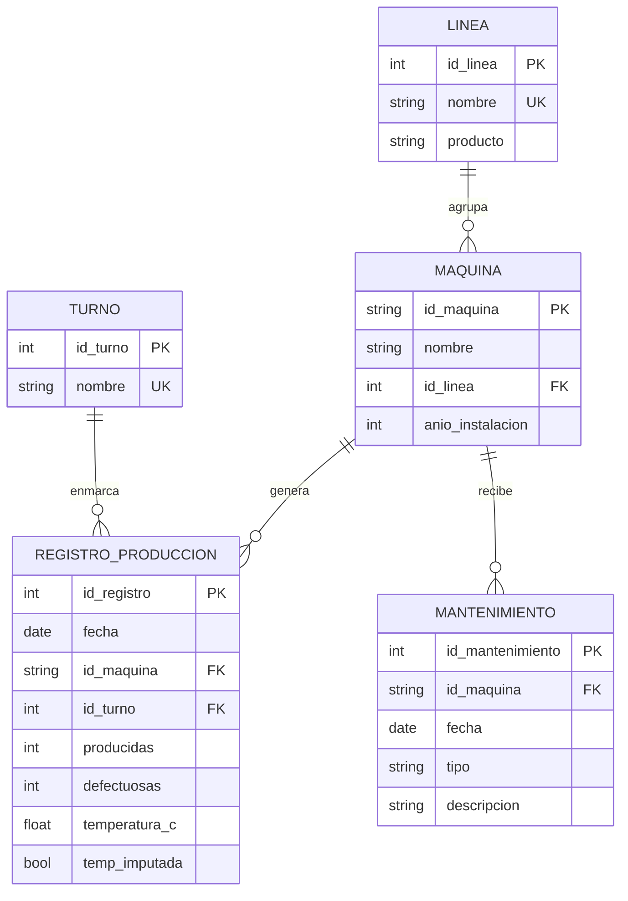

# c2-activity · Corte 2 — Modelo, consulta y limpieza de datos

| | |
|---|---|
| **Estudiante** | Cristhian Gaitán Guzmán |
| **Programa** | Ingeniería Industrial · Facultad de Ingeniería, CORHUILA |
| **Asignatura** | Ciencia de Datos (Cód. 69109) · Pénsum 40D · Grupo 1 · 2026-B |
| **Docente** | Jesús Ariel González Bonilla |
| **Actividad** | c2-activity · Semana 9 (semana 4 del Corte 2) · Valor 5.0 |
| **Cierre** | Domingo 4 de octubre de 2026, 23:59 |
| **Entrega** | Fork del repositorio de la clase, carpeta `09-week/c2-activity/` |

---

## Caso

La planta de empaques del Huila fabrica película y bolsas con **4 máquinas** repartidas en **2 líneas** y trabaja **3 turnos**. Al cierre de cada turno, un supervisor digita a mano cuántas unidades produjo cada máquina, cuántas salieron defectuosas y a qué temperatura cerró. Con ese registro, la gerencia quiere decidir **a qué máquina le hace mantenimiento primero**.

Esto sigue la línea que traemos desde el Corte 1: usar los datos de los equipos para decidir *dónde y cuándo* intervenir antes de que una falla detenga la producción (mantenimiento predictivo [1]). Aquí el punto de partida es más modesto: antes de predecir nada hay que lograr que el registro sea confiable. El dataset es el de la actividad en clase de la Semana 9 [2] (297 filas, 6 columnas, 4 semanas de producción del 7 de septiembre al 3 de octubre de 2026), un caso ilustrativo y no datos de una planta real de Siemens.

**Pregunta de negocio:** *¿Qué máquina y qué turno concentran los defectos, y a cuál le hacemos mantenimiento primero?*

---

## Contenido

### 1. Diseño del ERD (1.5 pts)

El modelo tiene **5 entidades** con sus atributos, llaves (PK/FK) y cardinalidades. El código SQL completo está en [`schema.sql`](schema.sql).



**Relaciones y cardinalidad**

| Relación | Cardinalidad | Lectura |
|---|---|---|
| `LINEA` → `MAQUINA` | 1 : N | Una línea agrupa varias máquinas; cada máquina pertenece a una sola línea. |
| `MAQUINA` → `REGISTRO_PRODUCCION` | 1 : N | Una máquina genera muchos registros (uno por turno y día). |
| `TURNO` → `REGISTRO_PRODUCCION` | 1 : N | Un turno enmarca muchos registros. |
| `MAQUINA` → `MANTENIMIENTO` | 1 : N | Una máquina puede recibir muchas intervenciones. |
| `MAQUINA` ↔ `TURNO` | N : M (resuelta) | Una máquina trabaja en varios turnos y un turno cubre varias máquinas; la tabla `REGISTRO_PRODUCCION` hace de entidad asociativa y además guarda las medidas de cada cruce. |

**Normalización.** El CSV original es una sola tabla ancha en la que cada fila repetiría el nombre de la máquina, su línea y su año de instalación. En el modelo esos datos viven **una sola vez** en `MAQUINA` y `LINEA` (hasta tercera forma normal: cada atributo depende de la llave y de nada más), y el registro solo guarda la llave `id_maquina`. Así, corregir el año de instalación de una máquina es un cambio en una fila, no en cientos.

**Dos decisiones de diseño que vale la pena explicar**

- Las **reglas del negocio** (máx. 1.800 unidades por turno, defectuosas entre 0 y las producidas, sensor de 15 a 60 °C, solo 4 máquinas y 3 turnos) quedaron como restricciones `CHECK`, y la combinación `(fecha, id_maquina, id_turno)` es `UNIQUE`. La base de datos rechaza por sí sola los mismos errores que más abajo se limpian a mano.
- `MANTENIMIENTO` es una entidad **de diseño**: apoya la decisión de negocio, pero el dataset no trae esos datos, así que se crea vacía y no se usa en las consultas de esta entrega.

---

### 2. Dataset y limpieza con pandas (2.0 pts)

**Dataset:** [`data/registro_produccion.csv`](data/registro_produccion.csv) · 297 filas × 6 columnas (`fecha`, `turno`, `maquina`, `producidas`, `defectuosas`, `temperatura`). El archivo original no se toca: toda la limpieza se hace sobre una copia, en el cuaderno ejecutado [`limpieza_y_consultas.ipynb`](limpieza_y_consultas.ipynb) (también como script: [`limpieza_c2.py`](limpieza_c2.py)), y cada paso queda anotado en la bitácora [`data/bitacora_limpieza.csv`](data/bitacora_limpieza.csv).

**Diagnóstico inicial (antes de limpiar)**

| Problema | Cantidad | Dimensión de calidad |
|---|---:|---|
| Filas duplicadas | 9 | Unicidad |
| Nulos en `defectuosas` | 10 | Completitud |
| Nulos en `temperatura` | 6 | Completitud |
| Formas distintas de escribir las 4 máquinas | 16 | Consistencia |
| Formas distintas de escribir los 3 turnos | 12 | Consistencia |
| Fechas en `dd/mm/aaaa` en vez de `aaaa-mm-dd` | 30 | Formato |
| `temperatura` guardada como texto (coma decimal) | 20 | Formato / tipos |
| Lecturas de temperatura en °F (> 60) | 14 | Validez |
| Valores imposibles según las reglas del negocio | 7 | Validez |

**Pasos de limpieza (en este orden)**

| Paso | Qué se hizo | Técnica en pandas | Filas | Valores corregidos |
|---|---|---|---|---:|
| 1 | Quitar duplicados | `drop_duplicates()` | 297 → 288 | 0 |
| 2 | Homologar máquinas y turnos | `str.strip()`, `str.upper()`, `str.capitalize()` + diccionario con `replace()` | 288 | 33 |
| 3 | Temperatura a número y fechas a un solo formato | `str.replace(",", ".")` + `to_numeric()`; `to_datetime(format=...)` por formato + `fillna()` | 288 | 50 |
| 4 | Lecturas °F → °C | regla del negocio (> 60 °C) + `.loc` con (°F − 32) × 5/9 | 288 | 14 |
| 5a | Eliminar filas sin `defectuosas` | `dropna(subset=...)` | 288 → 278 | 0 |
| 5b | Imputar temperatura con la mediana de su máquina | `groupby().transform("median")` + `fillna()` | 278 | 6 |
| 6 | Eliminar valores imposibles | reglas con `>`, `<`, `\|` y filtro con `~` | 278 → 271 | 0 |

**Decisiones de analista** (las que no son obvias):

- **`defectuosas` vacía → se elimina.** Es justamente lo que se quiere medir; rellenarla con un promedio sería inventar defectos y alteraría la tasa de la máquina.
- **`temperatura` vacía → se imputa con la mediana de su máquina** y se marca en `temp_imputada`, porque es una variable de apoyo y cada máquina trabaja a su propia temperatura. Lo estimado nunca se confunde con lo medido.
- **Imposibles → se eliminan, no se "arreglan".** Había 2 filas sobre la capacidad (un cero de más, p. ej. 11.320 unidades), 3 con columnas invertidas (16 producidas y 959 defectuosas) y 2 negativas. Adivinar la corrección también es inventar; lo correcto sería preguntarle al supervisor.
- **Atípicos de temperatura → se investigan, no se borran.** Con la regla del IQR (límites 26,2 a 38,2 °C) salen 13 atípicos. Ninguno está fuera del rango del sensor, así que son lecturas reales y no errores. Todos son de la M-03 y 12 de los 13 ocurren en el turno de la tarde; son una pista, no ruido.

**Reporte antes / después** ([`data/antes_despues.csv`](data/antes_despues.csv))

| Indicador | Antes | Después |
|---|---:|---:|
| Filas | 297 | 271 |
| Celdas vacías (nulos) | 16 | 0 |
| Filas duplicadas | 9 | 0 |
| Valores distintos en `maquina` (esperado 4) | 16 | 4 |
| Valores distintos en `turno` (esperado 3) | 12 | 3 |
| Fechas fuera de `aaaa-mm-dd` | 30 | 0 |
| Tipo de `temperatura` | texto | numérico |
| Tipo de `fecha` | texto | fecha |
| **Calidad · Completitud** | 94,6 % | **100 %** |
| **Calidad · Unicidad** | 97,0 % | **100 %** |
| **Calidad · Consistencia** | 88,9 % | **100 %** |
| **Calidad · Formato** | 89,9 % | **100 %** |
| **Calidad · Validez** | 80,8 % | **100 %** |

En total se descartaron **26 filas (8,8 %)**: 9 duplicadas, 10 sin el dato clave y 7 imposibles. Todas las demás se conservaron y se corrigieron.

**Dos dimensiones de calidad que mejoraron de forma clara**

1. **Validez (80,8 % → 100 %).** Era la peor: casi una de cada cinco filas violaba una regla del negocio. Convertir 14 lecturas de °F a °C, corregir las comas decimales y descartar las 7 filas imposibles hizo que todos los valores fueran posibles. Esto es lo que cambió la lectura de los datos: con una temperatura de 95 "grados" mezclada con las demás, cualquier promedio de temperatura habría salido inflado.
2. **Consistencia (88,9 % → 100 %).** Para una persona `M-03`, `m-03` y `M3` son la misma máquina; para Python son textos distintos. La tabla tenía 16 "máquinas" y 12 "turnos". Tras homologar quedan 4 y 3, y los resultados por máquina y por turno por fin se pueden agrupar.

Archivo resultante: [`data/registro_produccion_limpio.csv`](data/registro_produccion_limpio.csv) · 271 filas × 7 columnas (las 6 originales + `temp_imputada`).

---

### 3. Dos preguntas con consultas y hallazgo (1.0 pt)

Las consultas están escritas en **SQL** sobre la base del ERD ([`consultas.sql`](consultas.sql)) y reproducidas en **pandas** (en el cuaderno y en [`consultas_c2.py`](consultas_c2.py)). Se carga la tabla limpia en SQLite ([`data/planta.db`](data/planta.db)), se ejecutan ambas versiones y se comprueba que dan exactamente el mismo resultado.

#### Pregunta 1 — ¿Qué máquinas superan la tasa de defectos de toda la planta?

*Filtro + agregación:* `GROUP BY` por máquina y `HAVING` contra la tasa global.

```sql
SELECT  m.id_maquina, m.nombre,
        SUM(r.producidas)  AS producidas,
        SUM(r.defectuosas) AS defectuosas,
        ROUND(100.0 * SUM(r.defectuosas) / SUM(r.producidas), 2) AS tasa_pct,
        ROUND((100.0 * SUM(r.defectuosas) / SUM(r.producidas))
              / (SELECT 100.0 * SUM(defectuosas) / SUM(producidas)
                 FROM registro_produccion), 2) AS veces_la_planta
FROM    registro_produccion r
JOIN    maquina m ON m.id_maquina = r.id_maquina
GROUP BY m.id_maquina, m.nombre
HAVING  100.0 * SUM(r.defectuosas) / SUM(r.producidas)
        > (SELECT 100.0 * SUM(defectuosas) / SUM(producidas) FROM registro_produccion)
ORDER BY tasa_pct DESC;
```

```python
tasa_planta = d["defectuosas"].sum() / d["producidas"].sum() * 100          # 2,21 %
por_maq = d.groupby("id_maquina").agg(producidas=("producidas", "sum"),
                                       defectuosas=("defectuosas", "sum"))
por_maq["tasa_pct"] = (por_maq["defectuosas"] / por_maq["producidas"] * 100).round(2)
p1 = por_maq[por_maq["defectuosas"] / por_maq["producidas"] * 100 > tasa_planta]
```

**Resultado**

| Máquina | Nombre | Producidas | Defectuosas | Tasa | Veces la planta |
|---|---|---:|---:|---:|---:|
| M-03 | Selladora C | 81.008 | 3.475 | **4,29 %** | 1,94 |

Para tener el contexto completo, el ranking de las cuatro máquinas (misma consulta sin el `HAVING`): M-03 4,29 % · M-01 1,73 % · M-02 1,61 % · M-04 1,21 %. La tasa de toda la planta es **2,21 %**.

**Hallazgo.** Solo la M-03 supera la tasa de la planta, y casi la duplica (1,94 veces). Las otras tres máquinas están entre 1,21 % y 1,73 %. La tasa se calculó con los **totales** de cada máquina y no promediando las tasas de cada fila, porque un turno grande debe pesar más que uno pequeño. Este resultado solo es confiable tras la limpieza: en el registro sin limpiar la tabla tenía 16 "máquinas", los datos de la M-03 quedaban repartidos entre varias de ellas, y entre los códigos bien escritos la M-01 aparecía con 5,93 % frente a 3,58 % de la M-03, lo que habría llevado a mandar a mantenimiento la máquina equivocada.

#### Pregunta 2 — En la M-03, ¿en qué turno se concentran los defectos y qué temperatura traía?

*Filtro + agregación:* `WHERE id_maquina = 'M-03'` y `GROUP BY` turno. La temperatura media usa solo lecturas medidas (se excluyen las imputadas, para no promediar datos estimados).

```sql
SELECT  t.nombre AS turno,
        COUNT(*) AS registros,
        ROUND(AVG(CASE WHEN r.temp_imputada = 0 THEN r.temperatura_c END), 1) AS temp_media_c,
        SUM(r.producidas)  AS producidas,
        SUM(r.defectuosas) AS defectuosas,
        ROUND(100.0 * SUM(r.defectuosas) / SUM(r.producidas), 2) AS tasa_pct
FROM    registro_produccion r
JOIN    turno t ON t.id_turno = r.id_turno
WHERE   r.id_maquina = 'M-03'
GROUP BY t.id_turno, t.nombre
ORDER BY tasa_pct DESC;
```

```python
m03 = d[d["id_maquina"] == "M-03"]
p2 = m03.groupby("turno").agg(registros=("producidas", "size"),
                              producidas=("producidas", "sum"),
                              defectuosas=("defectuosas", "sum"))
p2["tasa_pct"] = (p2["defectuosas"] / p2["producidas"] * 100).round(2)
```

**Resultado**

| Turno | Registros | Temp. media (°C) | Producidas | Defectuosas | Tasa |
|---|---:|---:|---:|---:|---:|
| **Tarde** | 23 | **38,5** | 26.923 | 1.736 | **6,45 %** |
| Mañana | 22 | 34,5 | 26.683 | 925 | 3,47 % |
| Noche | 22 | 30,7 | 27.402 | 814 | 2,97 % |

**Hallazgo.** Dentro de la M-03, el problema se concentra en la **tarde**: allí la tasa llega a 6,45 %, casi el doble que en la mañana y más del doble que en la noche. Es también el turno más caliente (38,5 °C de media, algo por encima del límite superior de 38,2 °C que marcó el IQR en la limpieza). La correlación entre temperatura y tasa de defectos, calculada sobre lecturas medidas, es **0,81 en la M-03** y **−0,04 en la M-01**: en la M-03 más calor viene con más defectos, y en la M-01 no hay relación. Como la M-03 es la más antigua de la planta (instalada en 2012; la M-04 es de 2023), una hipótesis razonable es desgaste o refrigeración insuficiente, **pero esto es una hipótesis**: la correlación no demuestra causalidad y habría que contrastarla con el historial de mantenimiento, justo la información que la entidad `MANTENIMIENTO` del ERD permitiría registrar.

**Recomendación.** Programar la inspección de la **M-03 primero**, con foco en su comportamiento térmico durante el turno de la tarde.

---

### 4. Data & cleaning (EN) (0.5 pts)

> **Data & cleaning**
>
> The dataset is a production log from a packaging plant in Huila, Colombia, with 297 rows and 6 columns (date, shift, machine, units produced, defective units and temperature) covering four weeks from September 7 to October 3, 2026. It was typed by hand by three supervisors, so it contained 9 duplicated rows, 16 missing values, 16 different spellings of 4 machine codes, 12 spellings of 3 shifts, 30 dates in a second format, 20 temperatures with a decimal comma and 14 readings in Fahrenheit. I cleaned it with pandas on a working copy, following a fixed order: removing duplicates, standardizing text, converting types and dates, converting units, handling missing values and removing impossible values. Rows without the defect count were dropped because that is the variable being measured, missing temperatures were imputed with each machine's median and flagged, and 7 rows that broke business rules were removed. After cleaning, 271 rows remain and all five quality dimensions (completeness, uniqueness, consistency, format and validity) went from between 80.8% and 97.0% to 100%. The first question asked which machines exceed the plant-wide defect rate of 2.21%, and only machine M-03 does, with 4.29%, almost twice the plant average. The second question asked in which shift M-03 concentrates its defects, and the answer is the afternoon, with a 6.45% defect rate and the highest mean temperature at 38.5 °C. Temperature and defect rate are strongly correlated on M-03 (r = 0.81) but not on M-01 (r = −0.04), which is a lead for maintenance rather than proof of causation.

---

## Limitaciones y puntos débiles

- **Es un dataset ilustrativo de una actividad en clase**, no datos de una planta real; los hallazgos sirven para practicar el método, no para decidir sobre equipos reales.
- **Se perdió el 8,8 % de las filas.** Eliminar es una decisión conservadora (no inventar datos), pero cada fila descartada es información que un supervisor podría haber corregido en la fuente.
- **La conversión °F → °C se apoya en una regla** (ningún valor real supera los 60 °C), no en una verificación contra el termómetro. Es razonable y coherente con el histograma, pero sigue siendo una suposición.
- **La imputación de temperatura** (6 valores) usa la mediana por máquina, no por turno; dado que la M-03 cambia mucho de una tarde a una noche, una mediana por máquina y turno sería más fina. Los 6 valores están marcados en `temp_imputada` y se excluyeron de la temperatura media de la Pregunta 2.
- **Correlación no es causalidad.** El 0,81 de la M-03 señala dónde investigar, no la causa.
- `MANTENIMIENTO` no tiene datos, así que el ERD está listo para la decisión pero esta entrega no la valida con historial real.

## Conclusión

Antes de preguntarle algo a los datos hubo que hacerlos confiables: la misma tabla que parecía decir "mantenimiento a la M-01" dice, ya limpia, "mantenimiento a la M-03, y mirando la tarde". El ERD deja cada hecho en un solo lugar y deja que la base de datos haga cumplir las reglas del negocio; la limpieza llevó las cinco dimensiones de calidad a 100 % con trazabilidad paso a paso; y las dos consultas, verificadas en SQL y en pandas, apuntan a la misma respuesta. Es el mismo hilo del caso de mantenimiento predictivo de las semanas anteriores: primero datos confiables, después modelos y decisiones.

## Estructura de la carpeta

```
09-week/c2-activity/
├── README.md                       ← este documento (ERD, resumen, Data & cleaning EN)
├── limpieza_y_consultas.ipynb      ← cuaderno EJECUTADO: diagnóstico → limpieza → antes/después → SQLite → 2 consultas
├── schema.sql                      ← DDL del ERD (SQLite, con reglas CHECK)
├── consultas.sql                   ← las dos consultas (+ contexto)
├── limpieza_c2.py                  ← misma limpieza como script
├── consultas_c2.py                 ← carga a SQLite, SQL vs pandas
└── data/
    ├── registro_produccion.csv         ← original (no se modifica)
    ├── registro_produccion_limpio.csv  ← resultado de la limpieza
    ├── bitacora_limpieza.csv           ← trazabilidad paso a paso
    ├── antes_despues.csv               ← comparación de calidad
    └── planta.db                       ← base SQLite construida desde el ERD
```

**Cómo reproducirlo** (Python 3.9+ y pandas), desde esta carpeta:

```bash
pip install pandas
jupyter notebook limpieza_y_consultas.ipynb   # cuaderno completo, ya viene ejecutado
# o, como scripts:
python limpieza_c2.py     # genera el CSV limpio, la bitácora y el antes/después
python consultas_c2.py    # crea planta.db, corre SQL y pandas, y los compara
```

## Entrega

1. Fork del repositorio de la clase y clon en el equipo (Manual de Entrega por GitHub).
2. Copiar esta carpeta en `09-week/c2-activity/`.
3. `git add .` · `git commit -m "Entrega c2-activity"` · `git push`.
4. Verificar que el repo de perfil tenga el bloque **CONFIG** (`FULL_NAME` + `GITHUB_USER`).

## Referencias

[1] IBM, "¿Qué es el mantenimiento predictivo?," IBM Think, 2026. [Online]. Available: https://www.ibm.com/think/topics/predictive-maintenance

[2] J. A. González Bonilla, "Taller en clase: Calidad de datos, diagnosticar, limpiar y medir," Ciencia de Datos, Corporación Universitaria del Huila (CORHUILA), Semana 9, Corte 2, 2026.

[3] P. P.-S. Chen, "The entity-relationship model—toward a unified view of data," *ACM Trans. Database Syst.*, vol. 1, no. 1, pp. 9–36, 1976.

[4] E. F. Codd, "A relational model of data for large shared data banks," *Commun. ACM*, vol. 13, no. 6, pp. 377–387, 1970.

[5] W. McKinney, "Data structures for statistical computing in Python," in *Proc. 9th Python in Science Conf. (SciPy)*, 2010, pp. 56–61.

[6] C. Batini and M. Scannapieco, *Data and Information Quality: Dimensions, Principles and Techniques*. Cham, Switzerland: Springer, 2016.

[7] H. Wickham, "Tidy data," *J. Statist. Softw.*, vol. 59, no. 10, pp. 1–23, 2014.

[8] SQLite Consortium, "SQLite documentation: CREATE TABLE (CHECK and UNIQUE constraints)." [Online]. Available: https://www.sqlite.org/lang_createtable.html
